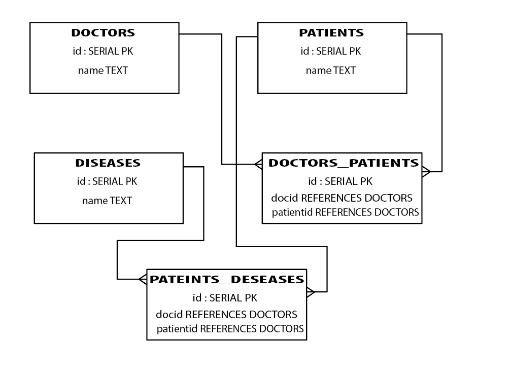

## Part One: Medical Center

```
DROP DATABASE IF EXISTS medical_center;  

CREATE DATABASE medical_center;  

\c medical_center  

CREATE TABLE doctors (id SERIAL PRIMARY KEY, first_name TEXT, last_name TEXT);  

CREATE TABLE patients (id SERIAL PRIMARY KEY, first_name TEXT, last_name TEXT);  

CREATE TABLE diseases (id SERIAL PRIMARY KEY, name TEXT);  

CREATE TABLE diseases_patients (id SERIAL PRIMARY KEY, patientid INTEGER REFERENCES patients, diseaseid INTEGER REFERENCES diseases);  

CREATE TABLE doctors_patients (id SERIAL PRIMARY KEY, patientid INTEGER REFERENCES patients, doctorid INTEGER REFERENCES doctors);  

INSERT INTO doctors (first_name, last_name) VALUES ('Gary', 'Brainguy');  
INSERT INTO doctors (first_name, last_name) VALUES ('Mark', 'Heartguy');  
INSERT INTO doctors (first_name, last_name) VALUES ('Stacy', 'Anesthesialady');  

INSERT INTO patients (first_name, last_name) VALUES ('Barry', 'Heartbad');  
INSERT INTO patients (first_name, last_name) VALUES ('Derek', 'Hurtlung');  
INSERT INTO patients (first_name, last_name) VALUES ('Andi', 'Gonefoot');  

INSERT INTO diseases (name) VALUES ('Alice in Wonderland Syndrome');  
INSERT INTO diseases (name) VALUES ('Mad Cow Disease');  
INSERT INTO diseases (name) VALUES ('Werewolf Syndrome');  

INSERT INTO diseases_patients (patientid, diseaseid) VALUES (1, 2);  
INSERT INTO diseases_patients (patientid, diseaseid) VALUES (1, 3);  
INSERT INTO diseases_patients (patientid, diseaseid) VALUES (2, 3);  

INSERT INTO  doctors_patients (patientid, doctorid) VALUES (1, 2);  
INSERT INTO  doctors_patients (patientid, doctorid) VALUES (1, 3);  
INSERT INTO  doctors_patients (patientid, doctorid) VALUES (2, 3);  


### *Find names of all patients and what diseases they have*
SELECT CONCAT(p.first_name, ' ', p.last_name), dis.name  
FROM patients as p  
JOIN diseases_patients as d  
ON p.id = d.patientid  
JOIN diseases dis  
ON d.diseaseid = dis.id;  
```